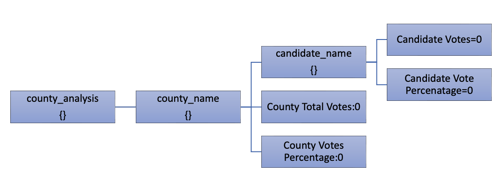

# Elections_Analysis

## Project Overview
This project is to automate the rreporting of total number of votes cast, the total number of votes for each candidate, the percentage of votes for each candidate, and the winner of the election based on the popular vote.

We will be assisting Tom ,employee of Colorado board of elections.

By the end of this project,we will be able to calculate:

- The total number of votes cast in the county election.
- Breakdown of the number of votes and the percentage of total votes for each county.
- Breakdown of the number of votes and the percentage of the total votes each candidate received.
- The county that received the largest number of votes.
- Candidate who won the election, their vote count and the percentage of the total votes.

And the result on terminal looks like

Results on textfile can be accessed : 

[ElectionAnalysis](Resources/Elections Analysis.txt)

### Data Source

[Election Results csv](Resources/election_results.csv)

### Softwares Used

Python 3.7.1 or above

Visual Studio 1.7.0 or above

## Summary

By the end of project,we concluded

1. Total Votes polled : 369,711

2. Total number of counties: 3

    - Arapohoe

    - Denver

    - Jeffereson

3. Total Candidates: 3

    * Charles Casper Stockham

    * Diana DeGette

    * Raymon Anthony Doane

4. Candidate Voting Summary:

    * Charles Casper Stockham received 23% votes with 85,213 number of votes.

    * Diana DeGette received 73.8% votes with 272,892 number of votes.

    * Raymon Anthony Doane received 3.1% votes with 11,606 number of votes.

5. County Voting Summary:

   - Jefferson county: 10.5% of toal votes polled i.e 38,855 votes.

    - Vote Share Breakdown

        --> Charles Casper Stockham: 19,723 votes

        --> Diana DeGette: 17,963 votes

        --> Raymon Anthony Doane: 1,169 votes

    - Leading Candidate: Charles Casper Stockham with 19,723 votes. 

    - This is 50.76% of total Jefferson county votes.

    - 23.15% of total Charles Casper Stockham PyPoll votes were polled in Jefferson county. 
    
  - Denver county: 82.8% of total votes i.e. 306,055 votes

    * Vote Share Breakdown

        --> Charles Casper Stockham: 57,188 votes

        --> Diana DeGette: 239,282 votes

        --> Raymon Anthony Doane: 9,585 votes

    * Leading Candidate: Diana DeGette with 239,282 votes. 

    * This is 78.18% of total Denver county votes.

    * 87.68% of total Diana DeGette PyPoll votes were polled in Denver county. 

 - Arapahoe county: 6.7% of total votes polled i.e. 24,801 votes.

    * Vote Share Breakdown

        --> Charles Casper Stockham: 8,302 votes

        --> Diana DeGette: 15,647 votes

        --> Raymon Anthony Doane: 852 votes

    * Leading Candidate: Diana DeGette with 15,647 votes. 

    * This is 63.09% of total Arapahoe county votes.

    * 5.73% of total Diana DeGette PyPoll votes were polled in Arapahoe county.

The winning candidate is Diane DeGette with 272,892 votes which is 73.8% of total votes.

Denver county witnessed most number of votes polled in precinct.

## Project Code Analysis

Before we start the code analysis,let us visually look at the dictionaries and list mapping which will make our code analysis part easy.

Please see PyPoll_challange.py for further reference or complete code analysis.

[PyPoll.py](PyPoll_Challange.py)

1. First step is to import dependencies.

        import os
        import csv

2. Initializing various variables,lists and dictionaries.

        total_votes=0 #Counter to counnt total number of votes polled
        candidate_list=[] # initialized a list to store names of Candidates
        county_list=[] # initialized a list to store name of counties
        candidate_analysis={} #  Empty dictionary to store various keys and values of a candidate
        county_analysis={} # Empty dictionary to store various keys and values of a county

3. creating path for the data file and opening file in read format.

        readfilepath=os.path.join('Resources','election_results.csv')
        # Assign a variable to load a file from a path.
        with open(readfilepath,"r") as election_results_csvfile:

4. Reading the header of the file and skipping to second line where data resides and start reading file one line at a time.This means we need for loop to iterate through every single line of data.

            #Read Header
            iter_election_data = iter(elections_data)
            next(iter_election_data)

            for rows in iter_election_data   :

This means all the read operations will be done in the for loop i.e adding and orgainzing data into list and dictionaries.

4a. Using conditional statements to check if county and candidate   names not in list and adding if not in two different conditional statements.

        if county_name not in county_analysis:
            county_list.append(county_name)
            county_analysis[county_name]={}
            # Adding keys and values to dic after initializing
            county_analysis[county_name]={"County Votes":0,"County Percentage":0}

        # Conditional statement to check if candidate name already exists in county_list[county name] dictionary
        # If not,initializing dictionary of candidate name under dictionary county_analysis[county name]
        if candidate_name not in county_analysis[county_name]:
            county_analysis[county_name][candidate_name]={}
            # Adding keys and values to dic after initializing
            county_analysis[county_name][candidate_name]={"Candidate Votes":0,"Candidate Percentage":0}

        #if condition to check if the name already exists
        if candidate_name not in candidate_list:
            # if not, add it to the list of candidates.
            candidate_list.append(candidate_name)
            candidate_analysis[candidate_name]={}
            candidate_analysis[candidate_name]["Total Candidate Votes"]=0

4b. Incrementing the value of particular candidate and county total vote variable in diiferent statements.

        #Followindg set of codes is basically a incremental counter
        # The total numbers of votes each candidate won 
        candidate_analysis[candidate_name]["Total Candidate Votes"] += 1
        # The total numbers of votes each candidate won in 
        county_analysis[county_name][candidate_name]["Candidate Votes"] += 1
        # The total numbers of votes polled in couunty 
        county_analysis[county_name]["County Votes"] += 1

After initializing and adding values to dictionaries and list,now we perform our analysis on the data.We will be iteraationg through county list and candidate list to do our analysis.

4.Same steps to follow to write file,first we create path and open file in write mode to write analysis data on text file.

        writefilepath=os.path.join('Resources','Elections Analysis.txt')
        with open(writefilepath,"w") as analysis_results_textfile:

All our operations are performed under this open file staement

5.Various calculation performed under nested for loops .

6.Using Write function to write data to text file.

        analysis_results_textfile.write(winning_county_summary)
        analysis_results_textfile.write(candidate_summary)

Results looks like this after formatting and writing data

7.Closing the data file and result files after the analysis process.

        election_results_csvfile.close()
        analysis_results_textfile.close()

## Proposed modification in Code and Analysis

Python automates the complex and tidious calucaltion to way simpler and fast process.This project is the classis example of converting the manual tidious work to simple automated process.

We have changed the data structure of dictionaries to be more versatile which allows us to perform many more data analysis operations.

We created a nested dictionary to organize and store data .Please look at the picture of parent dictionary which help us understand the dictionary better.

This is one dict which is enough to perform all possible data analysis operations.Further,we were able to caluculate candidate votes in each county and percentage.

